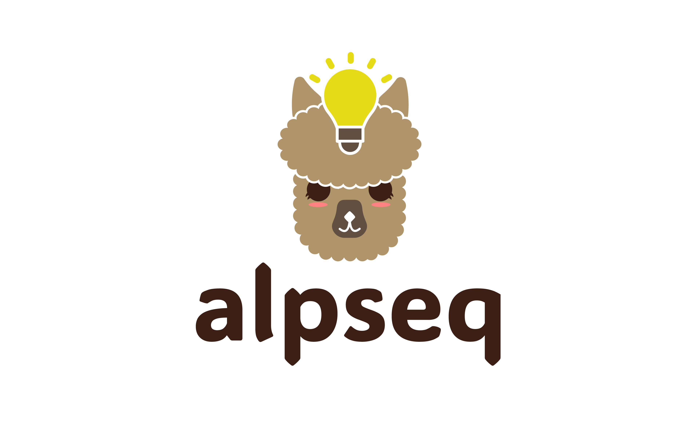

# alpseq
Nextflow pipeline for analysing illumina 2x300bp nanobody sequencing data



:star: Before running the pipeline, make sure to edit the nextflow.config file to suit your system and point to the correct input and output directories.

## Usage
The quickest way to run *alpseq* is by running the command below (after editing the `nextflow.config` file):

```
nextflow run ./main.nf -profile <docker or singularity> 
```
Or by running it through the [seqera cloud platform's](https://cloud.seqera.io/) GUI.

For detailed usage instructions, [check out the documentation website](https://kzeglinski.github.io/alpseq_documentation/)


